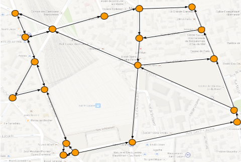
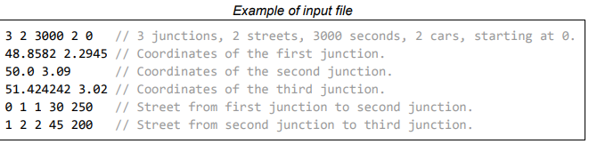
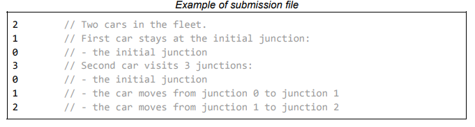

# Street Viewer Routing

## Introduction
The Street View imagery available in Google Maps is captured using specialized vehicles called
**Street View cars**. These cars carry multiple cameras capturing pictures as the car moves around a
city.
Capturing the imagery of a city poses an optimization problem ­ the fleet of cars is available for a
limited amount of time and we want to cover as much of the city streets as possible.
## Task
Given a description of city streets and a number of Street View cars available for a period of time, your
task is to schedule the movement of the cars to maximize the total length of city streets that were
traversed at least once.
## Problem description

### City
The city is represented by a graph, the nodes of which represent city junctions and are connected with edges representing the streets. The graph is a realistic but idealized representation of a certain
city ­ the junctions are associated with concrete geographic locations.

**Streets** are modelled as straight segments connecting two junctions. Each street has three
properties:

- **direction** - each street can be either one, or bi­directional.
- **length** - the distance in meters that a StreetView car covers while moving through the street.
This distance contributes to teams score, it corresponds to the real length of the (possibly
curvy) street.
- **cost** (time) - the amount of time in seconds that a StreetView car takes to traverse the street.

Each pair of junctions is connected by at most one street. Each street connects two different
junctions. The graph is not necessarily be planar (due to bridges and tunnels).
Both junctions and streets are referred to using their 0­based indices corresponding to the order in
which they appear in the input file (see below).

## Moving the cars

Your team manages a fleet of **N** cars, all located at the junction S at the beginning of the game. The teams should schedule the cars movement for **T** seconds ­ this is the virtual time for the car movement on the map, it is independent from the duration of the competition. The teams have the full
duration of the competition to provide an itinerary that covers the movement of the cars for **T** virtual seconds.  
All car movement scheduled in the itinerary has to complete in **T** seconds (or less) ­ a car cannot be
in transit when the time runs out.
The score of the team is the total length of all streets that were traversed by at least one car of their
fleet at least once. Traversing a street that was already traversed multiple times (including traversing a
bi­directional street in the opposite direction) does not increase the score.

# Input data

The input data is provided as a plain text file containing exclusively ASCII characters with lines
terminated with UNIX­style line endings (single ‘\n’ character ending each line).

The file consists of:
- one line containing the following natural numbers separated by single spaces:
    * **N** denotes the number of junctions in the city
    * **M** denotes the number of streets in the city
    * **T** denotes the virtual time in seconds allowed for the car itineraries
    * **C** denotes the number of cars in the fleet
    * **S** denotes the junction at which all the cars are located initially
- **N** subsequent lines describing individual junctions. The i­-th (0 ≤ i < N) such line contains the following decimal numbers separated by a single space and describing the the i­th junction of
the city:
  * **lati** and **longi** (− 90 ≤ lati ≤ 90, − 180 ≤ longi ≤ 180) denote the geographical coordinates of the junction in decimal degrees
- **M** subsequent lines describing individual streets. The j­th (0 ≤ j < M) such line contains the following natural numbers separated by single spaces and describing the j­th street of the city:
  * **Aj** and **Bj** (0 ≤ Aj ,Bj < N) (Aj =/ Bj) denote the indices (0­-based) of two junctions connected by the street. 
  * **Dj** is either 1 or 2. If **Dj** equals 1, the j­-th street is one­directional and can be traversed only from the junction **Aj** towards the junction **Bj**. Otherwise (for **Dj** equal to 2) the street can be traversed in both directions
  * **Cj** denotes the time cost of traversing the street: the time, in virtual seconds, a car needs to traverse the street
  * **Lj** denotes the length, in meters, of the street. This is the score that is awarded for traversing the street for the first time.

# Submissions

## File format

Team submission needs to be described in a plain­text ASCII file with either Unix­style or Windows­style line endings.

The file needs to start with one line containing a single natural number **C** representing the number of cars in the teams fleet. Then itineraries for each car of the fleet should be described in the format
indicated below.

The itinerary for the i-­th car should start with one line containing a single natural number **Vi** (0 ≤ i < C) (1 ≤ V i ≤ 10⁶) denoting the number of junctions visited by the car. This should include the initial junction **S** as the first junction. Subsequently, the itinerary needs to contain **Vi** lines describing the junctions
visited by the car in the order that they were visited. Each line should contain a single natural number denoting the index (0­-based) of the junction.

## Validation

For the solution to be accepted, it has to meet the following criteria:
 - the format of the file has to match the description above,
 - the number of cars in the fleet **C** has to match the number of cars indicated in the problem input,
 - the number of cars in the fleet **C** has to match the number of cars indicated in the problem input,
 - for each consecutive pair of junctions on the itinerary, a street connecting these junctions has to exist in the input file,
    *  if the street is one­directional, it has to be traversed in the correct direction,
-  total time for each itinerary has to be lower or equal to **T**,

## Scoring

The score of a solution is the total length of the streets which have been visited at least once by a car in the fleet.

Each valid submission will be immediately scored and the score will be revealed to the team. The teams are allowed to submit multiple solutions ­ the highest scoring valid solution from each team will
be used for team ranking.

Teams will be ranked according to their best submission score. In an event of a tie (two teams having the same best submission score), the team that reached that score for the first time earlier will be ranked higher. Resubmitting the same best solution again does not hurt the teams ranking.

